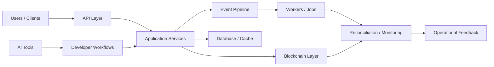

<!-- GitHub Profile README -->

<div align="center">


</div>

<p align="center">
  
</p>

---

## Overview

This space is used for experiments, tools, notes, and systems around backend engineering, distributed systems, blockchain infrastructure, cloud automation, and AI-assisted development.

The focus is mostly on practical engineering: building things that are understandable, reliable, secure, and easy to operate.

---

## Focus Areas

```txt
Backend systems
Distributed architecture
Blockchain infrastructure
Cloud automation
AI-assisted engineering
Developer tooling
Architecture notes
Operational patterns
```

---

## Core Capabilities

<table>
  <tr>
    <td width="50%">
      <h3>Backend Engineering</h3>
      <p>APIs, services, integrations, background jobs, data processing, and production-oriented backend patterns.</p>
    </td>
    <td width="50%">
      <h3>Distributed Systems</h3>
      <p>Queues, caches, databases, event-driven flows, consistency, reconciliation, and reliability concerns.</p>
    </td>
  </tr>
  <tr>
    <td width="50%">
      <h3>Blockchain Infrastructure</h3>
      <p>Smart contracts, custody flows, withdrawal controls, EVM architecture, and on-chain/off-chain coordination.</p>
    </td>
    <td width="50%">
      <h3>Cloud & DevOps</h3>
      <p>AWS, Linux, Docker, reverse proxies, CI/CD, deployment automation, and operational tooling.</p>
    </td>
  </tr>
  <tr>
    <td width="50%">
      <h3>AI Engineering</h3>
      <p>AI agents, MCP integrations, prompt-driven development, workflow automation, and multi-model tooling.</p>
    </td>
    <td width="50%">
      <h3>Engineering Leadership</h3>
      <p>Architecture reviews, delivery planning, engineering enablement, team processes, and technical decision-making.</p>
    </td>
  </tr>
</table>

---

## Common Stack

<p align="left">
  
  
  
  
  
  
  
  
  
  
  
  
  
  
  
  
</p>

---

## Engineering Notes

```txt
Prefer simple systems.
Design for recovery.
Automate repeated work.
Keep production observable.
Make architecture explainable.
Treat security as part of the design.
Optimize only after understanding the system.
```

---

## Areas of Interest

| Area | Topics |
|---|---|
| Backend Platforms | APIs, services, integrations, event-driven systems |
| Distributed Systems | Kafka, Redis, queues, jobs, consistency, reconciliation |
| Blockchain | Solidity, EVM, custody, withdrawal safety, smart contract design |
| Cloud Infrastructure | AWS, Docker, Linux, NGINX, deployment automation |
| AI Workflows | Agents, MCP, prompt engineering, developer tooling |
| Architecture | System design, operational recovery, observability, automation |

---

## Architecture Sketch



---

## Repository Themes

```txt
experiments/
tools/
automation/
architecture/
notes/
learning/
security/
infrastructure/
```

---

## GitHub Activity

<div align="center">


</div>

---

## Contribution Flow

<div align="center">


</div>

---

## Working Style

```yaml
approach:
  - understand the real problem
  - keep the solution practical
  - reduce unnecessary complexity
  - automate repeatable steps
  - document important decisions
  - build with recovery in mind

values:
  - clarity
  - reliability
  - security
  - maintainability
  - continuous improvement
```

---

<div align="center">

```txt
Build clearly. Operate safely. Improve continuously.
```

</div>

<div align="center">


</div>
