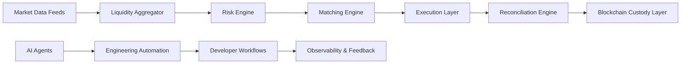
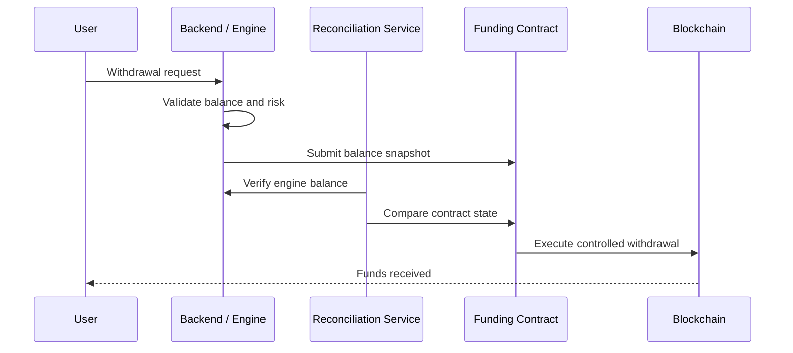

<!--
  GitHub Profile README for Mihindu Karunarathne
  Repo name must be: mihindu-alphadevs
-->

<div align="center">


</div>

<p align="center">
  
</p>

<p align="center">
  <a href="https://github.com/mihindu-alphadevs">
    
  </a>
  <a href="https://github.com/mihindu-alphadevs?tab=followers">
    
  </a>
  <a href="https://github.com/mihindu-alphadevs?tab=repositories">
    
  </a>
</p>

---

## `/whoami`

```bash
> identity

Mihindu Karunarathne

> role

Systems Architect
Blockchain Infrastructure Engineer
AI-Native Builder
Engineering Leader

> core_stack

Java | Spring Boot | Solidity | AWS | Kafka | Redis | Docker | Angular | AI Agents

> current_mode

Building secure, scalable and low-latency infrastructure for modern financial,
blockchain and AI-driven systems.
```

---

## `SYSTEM STATUS`

```yaml
Architecture:      OPERATIONAL
Security:          HARDENED
Latency:           OPTIMIZED
Scalability:       IN_PROGRESS
AI Workflows:      ACTIVE
Blockchain Infra:  ACTIVE
Coffee Level:      CRITICAL
Production Mindset: ALWAYS_ON
```

---

## About Me

I build and lead engineering around systems where **performance, security, reliability and operational clarity matter**.

My work spans:

- Low-latency trading and matching engine infrastructure
- Blockchain custody, withdrawal and reconciliation systems
- Enterprise-scale integration platforms
- AI-assisted engineering workflows
- Cloud-native infrastructure and automation
- Secure backend architecture with Java, Spring Boot and EVM smart contracts

I enjoy turning complex business and technical problems into clean, scalable and explainable systems.

---

## Current Focus

<table>
  <tr>
    <td width="50%">
      <h3>⚡ Low-Latency Systems</h3>
      <p>Matching engines, liquidity feeds, spread calculations, market data processing and performance-oriented backend design.</p>
    </td>
    <td width="50%">
      <h3>🔐 Blockchain Infrastructure</h3>
      <p>Custody systems, smart contract security, withdrawal controls, reconciliation flows and EVM architecture.</p>
    </td>
  </tr>
  <tr>
    <td width="50%">
      <h3>🤖 AI Engineering</h3>
      <p>AI-assisted development workflows, MCP integrations, agents, automation and multi-model orchestration.</p>
    </td>
    <td width="50%">
      <h3>☁️ Cloud & DevOps</h3>
      <p>AWS, Docker, CI/CD, Linux, NGINX, infrastructure automation and production-grade deployment patterns.</p>
    </td>
  </tr>
</table>

---

## Tech Arsenal

### Core Engineering

<p>
  
  
  
  
  
</p>

### Distributed Systems & Data

<p>
  
  
  
  
  
</p>

### Blockchain & Web3

<p>
  
  
  
  
  
  
</p>

### Cloud, DevOps & Infra

<p>
  
  
  
  
  
  
  
  
</p>

### Frontend & Product

<p>
  
  
  
  
</p>

### AI Engineering

<p>
  
  
  
  
</p>

---

## Architecture Thinking



---

## Blockchain Custody Flow



---

## Engineering Principles

```txt
01. Security is architecture, not a feature.
02. Simple systems survive longer.
03. Observability should exist before incidents.
04. Performance problems are design feedback.
05. Automation is leverage.
06. Reconciliation beats assumption.
07. Production systems need recovery paths.
08. Good architecture explains itself.
```

---

## GitHub Analytics

<div align="center">


</div>

<div align="center">


</div>

---

## Contribution Graph

<div align="center">


</div>

---

## Profile Summary

<div align="center">


</div>

---

## Contribution Snake

<div align="center">


</div>

---

## Featured Engineering Areas

<table>
  <tr>
    <td align="center" width="33%">
      <h3>Trading Infrastructure</h3>
      <p>Market data, spreads, liquidity, matching engines and low-latency processing.</p>
    </td>
    <td align="center" width="33%">
      <h3>Smart Contract Security</h3>
      <p>Withdrawal safety, timelocks, emergency controls and reconciliation-first custody.</p>
    </td>
    <td align="center" width="33%">
      <h3>AI-Native Engineering</h3>
      <p>Agents, MCP, developer automation and AI-assisted architecture workflows.</p>
    </td>
  </tr>
</table>

---

## Recommended Repositories To Explore

<!-- Replace these with your real repos once ready -->

| Repository | Purpose |
|---|---|
| `matching-engine-playground` | Low-latency trading and order matching experiments |
| `evm-security-notes` | Smart contract security patterns and audit notes |
| `blockchain-reconciliation-patterns` | Custody, balance verification and withdrawal safety models |
| `ai-engineering-playbook` | AI-assisted software engineering workflows |
| `distributed-systems-lab` | Kafka, Redis, event-driven and scalable backend experiments |
| `infra-automation-scripts` | AWS, Docker, Linux and deployment automation |

---

## What I Like Building

```json
{
  "systems": [
    "low latency engines",
    "distributed backends",
    "event-driven platforms",
    "reconciliation services"
  ],
  "blockchain": [
    "custody contracts",
    "withdrawal controls",
    "timelocks",
    "EVM security patterns"
  ],
  "ai": [
    "agent workflows",
    "MCP integrations",
    "AI developer tooling",
    "automation layers"
  ],
  "leadership": [
    "engineering strategy",
    "team enablement",
    "architecture reviews",
    "delivery execution"
  ]
}
```

---

## Operating Philosophy

> Build systems that are secure by default, observable under pressure and simple enough to explain when production is on fire.

---

## Connect

<p align="center">
  <a href="https://github.com/mihindu-alphadevs">
    
  </a>
  <!-- Replace with your LinkedIn URL -->
  <a href="https://www.linkedin.com/">
    
  </a>
  <!-- Replace with your website URL if you have one -->
  <a href="https://alphadevs.io">
    
  </a>
</p>

---

<div align="center">

```bash
while(system.isComplex()) {
    simplify();
    secure();
    observe();
    scale();
}
```

</div>

<div align="center">


</div>
